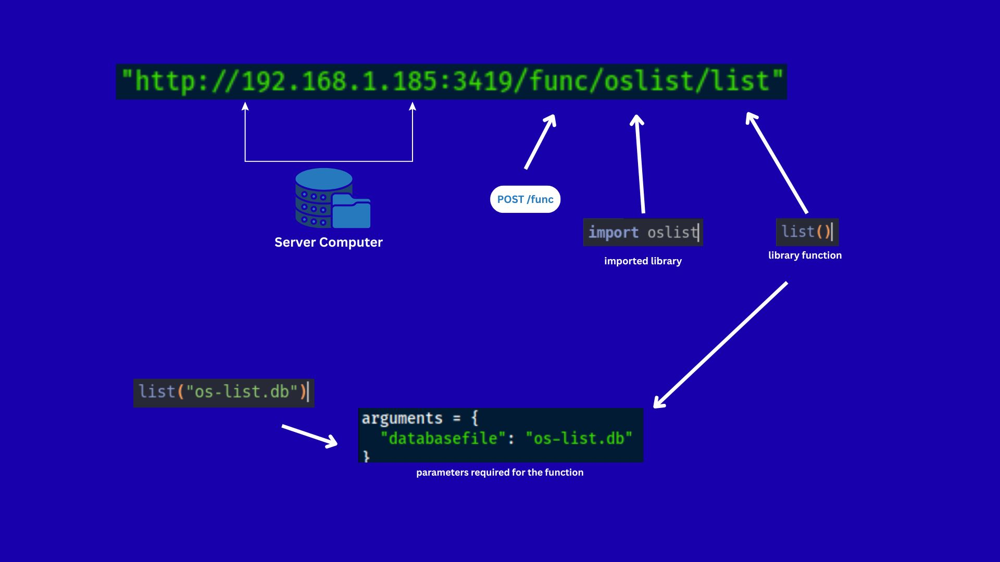
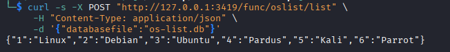

### remote-function-execution

This project is a **remote function execution architecture** system designed for IoT devices and low-resource systems.

Instead of running heavy frameworks or libraries locally, devices can remotely execute libraries hosted on a central server using HTTP requests.

The system dynamically loads libraries and executes the functions of the libraries triggered by the client via API, sending the resulting output back to the client.

------------------------------------------------------------------------

## Project Purpose

Modern IoT and embedded devices, low-requirement computers, and automation systems that need to run continuously often suffer from the following problems:

- Limited CPU and memory
- Inability to run heavy libraries
- Platform dependency issues
- Update problems

This project solves these problems by:

1. Offloading the computational load to a central server
2. Enabling devices to call functions remotely via API
3. Supporting dynamic function and method execution
4. Eliminating the need for local framework installations
5. Providing scalable and sustainable architectures

In short:

> **Instead of importing a library, devices call an API endpoint.**

Example:

    POST /func/oslist/list

This behaves like:

```
import oslist
oslist.list()
```

------------------------------------------------------------------------

## System Architecture

Below is the high-level architecture of the system:



### Flow Explanation:

1.  Client (IoT / PC / Script) sends a POST request
2.  Request contains:
    -   Framework name
    -   Method name
    -   Optional parameters
3.  Server:
    -   Dynamically loads the requested module
    -   Executes the selected method
    -   Passes JSON arguments
4.  Result is returned as JSON response (Even if the library outputs are not set as JSON, normal output can still be returned)

### Example Request:

```
POST /func/oslist/list
```

### Example Payload:

``` json
{
  "databasefile": "os-list.db"
}
```

The `client_example.py` script in the repository prepares how to send this request. You can run the script to see the result.

### Request with `curl` command:

```
curl -s -X POST "<SERVER>/func/<FRAMEWORK>/<METHOD>" \
     -H "Content-Type: application/json" \
     -d '{"a":10,"b":20}'
```

To see real results now, run this:
```
curl -s -X POST "http://127.0.0.1:3419/func/oslist/list" \
     -H "Content-Type: application/json" \
     -d '{"databasefile":"os-list.db"}'
```
### Example Output:

------------------------------------------------------------------------

## How to running server ?

After downloading the project, run this:

`uvicorn app:app --reload --host 0.0.0.0 --port 3419`

------------------------------------------------------------------------

## Used Libraries & Technologies

### Backend

-   FastAPI
-   Uvicorn
-   inspect
-   importlib

### Client Side

-   requests (Python)
-   curl (CLI / IoT usage)

### Architecture

-   REST-based communication
-   Dynamic module & method execution
-   JSON-based parameter passing
-   IoT-friendly design

------------------------------------------------------------------------
